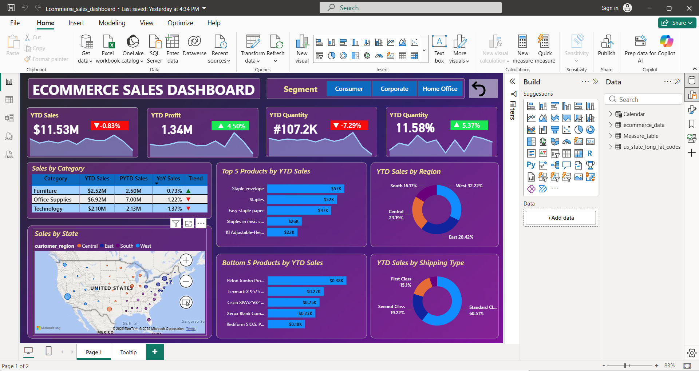

# PowerBI-Ecommerce-Sales-Dashboard
Interactive Power BI dashboard for analyzing e-commerce sales performance using DAX, Power Query, and data modeling.
# 📊 Power BI E-Commerce Sales Dashboard

## Project Overview

This project is an interactive Power BI dashboard developed to analyze e-commerce sales performance. It enables users to explore key business metrics, identify sales trends, monitor product performance, and gain actionable business insights through interactive visualizations.

---

## Dashboard Preview

---

## Features

- Interactive KPI Cards
- Sales Trend Analysis
- Product & Category Performance
- Customer Analysis
- Regional Sales Visualization
- Interactive Slicers
- Cross-filtering Across Visuals
- Custom Report Tooltip
- Bookmark-Based Reset Button

---

## Tools & Technologies

- Power BI Desktop
- Power Query
- DAX (Data Analysis Expressions)
- Data Modeling
- Microsoft Excel / CSV

---

## Dataset

The dashboard analyzes e-commerce sales data to provide insights into:

- Sales Performance
- Customer Segments
- Product Categories
- Regional Sales
- Business KPIs

---

## Skills Demonstrated

- Data Cleaning
- Data Transformation
- Data Modeling
- DAX Measures
- Business Intelligence
- Dashboard Development
- Interactive Data Visualization

---

## Repository Contents

- `Ecommerce_sales_dashboard.pbix` – Power BI project file
- `ecommerce_data.csv` – Dataset
- `dashboard_preview.png` – Dashboard screenshot
- `us_state_long_lat_codes.csv` – Supporting location data for map visualization

---

## Author

**Vidhya Rabi**

Aspiring Data Analyst | Power BI Developer

**Skills:** SQL • Python • Power BI • DAX • Power Query • Data Modeling • Data Visualization
